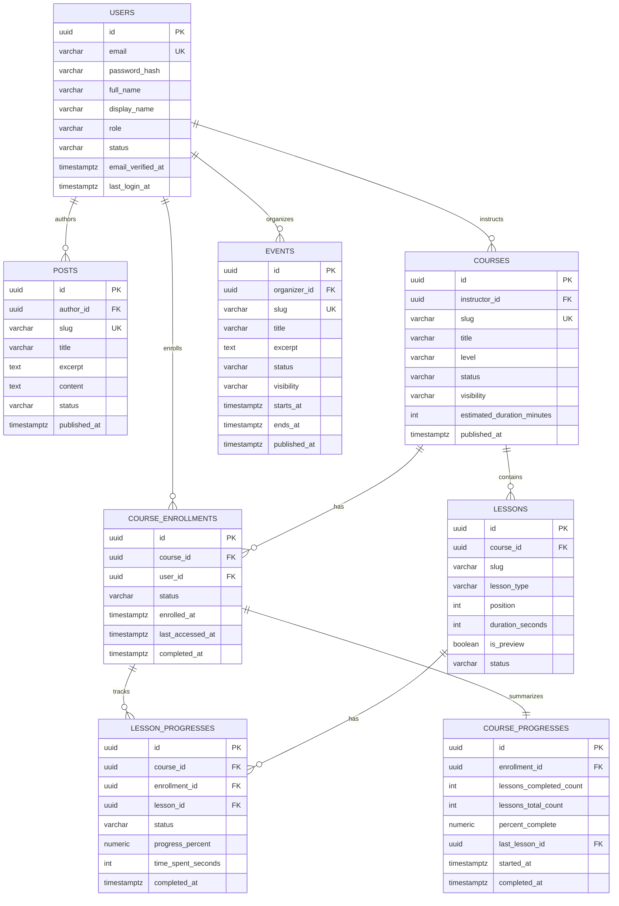

# DB Schema V1

## Scope

Schema v1 phuc vu 5 aggregate MVP:

- `users`
- `posts`
- `courses`
- `lessons`
- `progress`
- `events`

De domain `progress` hoat dong duoc o muc DB, v1 bo sung 3 bang phu:

- `course_enrollments`: quan he user hoc course
- `course_progresses`: snapshot tien do theo course
- `lesson_progresses`: chi tiet tien do theo lesson

## Design Principles

- Dung `UUID` cho primary key de an toan khi scale theo service/module sau nay.
- Tach `status` va `published_at` de ho tro workflow draft/review/publish.
- `lessons.position` giu thu tu hien thi on dinh trong course.
- `progress` duoc tach thanh snapshot (`course_progresses`) va granular state (`lesson_progresses`) de vua de query dashboard, vua giu du chi tiet.
- V1 chot `1 course -> 1 instructor`. Multi-instructor de phase sau.
- V1 chot `1 event -> 1 organizer`. Multi-organizer de phase sau.
- V1 chua gom category/tag/comment/quiz/certificate.

## Entity Notes

### `users`

- Dai dien cho auth principal + thong tin profile co ban.
- `role` gom: `member`, `editor`, `instructor`, `admin`.
- `status` gom: `pending`, `active`, `suspended`.

### `posts`

- Dung cho blog/CMS post.
- `slug` unique toan cuc.
- `author_id` tro toi `users`.

### `courses`

- Moi course co 1 `instructor_id`.
- `visibility` tach rieng khoi `status` de phan biet private/unlisted/public.
- `estimated_duration_minutes` la thong so tong quan, khong thay the tong thoi luong lesson.

### `lessons`

- Thuoc 1 course.
- `position` unique trong tung course.
- `lesson_type` v1 ho tro: `video`, `article`, `live`, `quiz`.
- `status` doc lap voi course de cho phep soan lesson truoc khi publish course.

### `course_enrollments`

- Moi user chi co 1 enrollment / course.
- `status` gom: `active`, `completed`, `dropped`.

### `events`

- Dung cho su kien cong khai tren homepage va landing page.
- Moi event co 1 `organizer_id`.
- `status` gom: `draft`, `published`, `cancelled`, `completed`.
- `visibility` gom: `private`, `unlisted`, `public`.

### `course_progresses`

- Snapshot 1-1 voi `course_enrollments`.
- Dung de doc nhanh % hoan thanh, lesson cuoi cung, completed state.

### `lesson_progresses`

- Luu state chi tiet tung lesson trong 1 enrollment.
- Co them `course_id` de DB validate lesson va enrollment cung thuoc mot course.

## ERD

## Table Summary

| Table | Purpose | Key constraints |
|---|---|---|
| `users` | User account + profile co ban | unique `lower(email)` |
| `posts` | Blog/CMS post | unique `lower(slug)` |
| `courses` | Course metadata | unique `lower(slug)` |
| `lessons` | Lesson thuoc course | unique `(course_id, lower(slug))`, unique `(course_id, position)` |
| `events` | Event metadata | unique `lower(slug)` |
| `course_enrollments` | User dang hoc course nao | unique `(course_id, user_id)` |
| `course_progresses` | Snapshot tien do course | unique `enrollment_id` |
| `lesson_progresses` | Tien do tung lesson | unique `(enrollment_id, lesson_id)` |

## Data Rules

- Xoa cung `course` se cascade xuong `lessons`, `course_enrollments`, `course_progresses`, `lesson_progresses`.
- `users`, `posts`, `courses`, `lessons`, `events` co `deleted_at` de ho tro soft delete o tang app.
- `progress` va `enrollment` la du lieu giao dich, khong dung soft delete trong v1.
- DB enforce `lesson_progresses.course_id` phai khop ca `course_enrollments.course_id` va `lessons.course_id`.

## Query Intent

Schema nay toi uu cho 5 query chinh:

1. Lay danh sach bai viet public moi nhat theo `status + published_at`.
2. Lay landing course va lesson list theo `slug`.
3. Lay dashboard "my learning" theo `user_id` tu `course_enrollments` + `course_progresses`.
4. Lay trang hoc lesson voi lesson progress chi tiet theo `enrollment_id + lesson_id`.
5. Lay homepage aggregate gom post moi, course noi bat va event sap toi.

## Open Items For V2

- Multi-instructor / course authorship table.
- Post category/tag va SEO block chuyen biet.
- Course module/section thay vi flat lesson list.
- Quiz attempt, certificate, review/rating.
- Audit log cho publish workflow.
